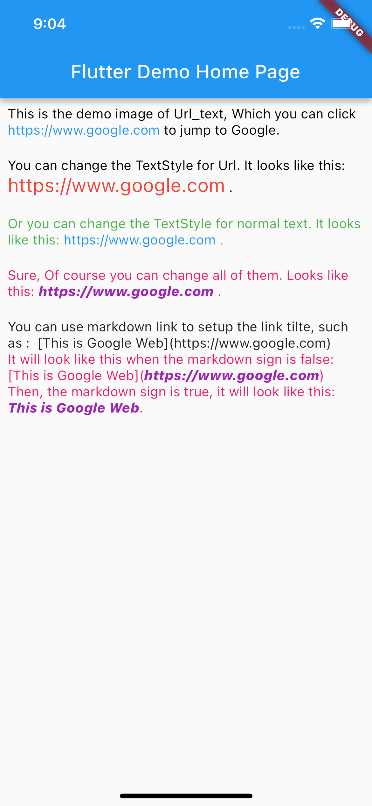

# url_text

Url Test. Identify web links in text and make them clickable.

## What is looks like?


## Getting Started

```dart
UrlText(
    text: 'This https://www.google.com is jump to Google.',
    urlStyle: TextStyle(color: Colors.green),
    style: TextStyle(color: Colors.pink),
),
```

## Publish to Pub.dev
```
flutter format .
flutter pub publish --dry-run
flutter pub publish
```